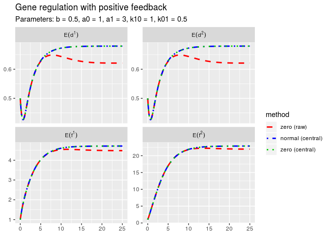

<!-- README.md is generated from README.Rmd. Please edit that file -->
pdmppoly
========

The goal of package `pdmppoly` is to simulate polynomial piecewise deterministic markov processes (polynomial PDMPs) within `R` and to provide methods to calculate or approximate their moments.

In additon, it contains all models that are used in the (not yet published) doctoral thesis of Charlotte Jana.

Installation
------------

You can install pdmppoly from github with:

``` r
# install.packages("devtools")
devtools::install_github("CharlotteJana/pdmppoly")
```

Polynomial PDMPs
----------------

A *polynomial PDMP* is a piecewise deterministic Markov process (PDMP), whose dynamics and rates are all polynomials, depending on the different variables and parameters of the PDMP.

A polynomial PDMP in `pdmppoly` is represented by an object of class `polyPdmpModel`. This class is very similar to class `pdmpModel` of package [pdmpsim](https://github.com/CharlotteJana/pdmpsim) and every method provided by [pdmpsim](https://github.com/CharlotteJana/pdmpsim) can be applied to `polyPdmpModel`-objects. The polynomials appear in the new slots `dynfunc` and `ratefunc`. They are defined using package [spray](https://github.com/RobinHankin/spray.git) and internally represented as sparse coefficient matrices.

This is a simple example modelling gene expression with positive feedback:

``` r
genePolyF <- new("polyPdmpModel",
     descr = "Gene regulation with positive feedback",
     parms = list(b = 0.2, a = 7, k10 = 0.04, k01 = 0.02), 
     init = c(f = 1, d = 1), 
     discStates = list(d = 0:1),
     dynpolys = quote(list(
       list(overall = linear(c(-b,a)))
     )),
     ratepolys = quote(list(  
       list(k01*lone(1,2), k10)
     )),
     jumpfunc = function(t, x, parms, jtype) {
       c(x[1], 1 - x[2])
     }, 
     times = c(from = 0, to = 100, by = 0.1), 
     solver = "lsodar")
```

Moment calculation
------------------

Function `momApp` calculates the moments of the distribution of of a polynomial PDMP, up to a given order. It solves a system of differential equaitons with package `deSove` to obtain the results. This system is usually not closed and has to be altered by replacing moments of higher orders with fixed values. The moments to replace can be raw or central moments, depending on the argument `centralize`. The following closure methods are available:

-   `closure = "zero"`: Replace the moments with 0
-   `closure = "normal"`: Replace with moments of a normal distribution
-   `closure = "lognormal"`: Replace with moments of a lognormal distribution
-   `closure = "gamma"`: Replace with moments of a gamma distribution

``` r
mom <- momApp(genePolyF, maxOrder = 4,
              closure = c("zero", "normal"), 
              centralize = c(FALSE, TRUE))
mom
#> Model: 
#> Description: Gene regulation with positive feedback
#> Parameters: b = 0.2, a = 7, k10 = 0.04, k01 = 0.02
#> Initial Values: f = 1, d = 1
#> 
#> Moment approximation for moments of order > 4 leads to 
#> 
#>             method order time         d            f
#> 1       zero (raw)     1  100 0.2390481     6.033003
#> 5 normal (central)     1  100 0.2489663     6.271148
#> 2       zero (raw)     2  100 0.2390481   129.849214
#> 6 normal (central)     2  100 0.2489663   133.903212
#> 3       zero (raw)     3  100 0.2390481  3336.182682
#> 7 normal (central)     3  100 0.2489663  3359.004623
#> 4       zero (raw)     4  100 0.2390481 82816.448562
#> 8 normal (central)     4  100 0.2489663 79945.177925
```

``` r
plot(mom, plotorder = 1:2)
```



### Compare with empirical moments

The results of `momApp` are approximated values of the moments of the distribution. To test their accuracy, it is best to simulate the model multiple times, calculate the empirical moments and compare them with the approximated moments.

``` r
simulations <- multSim(genePolyF, seeds = 1:30)
mom <- addSimulation(mom, simulations)
plot(mom, plotorder = 1:4, vars = "f")
```

Test if the distribution is unimodal
------------------------------------

The results of function `momApp` can also be used to test if the distribution of the PDMP is unimodal. Function `is.unimodal` from package `momcalc` performs this test for one dimensional distributions. It is only meaningful for distributions with a known compact support. Package `pdmppoly` provides function `modalityTest` to apply the test directly on a data.frame generated by `momApp`. It performs the test for every time value and every variable of the PDMP seperately.

``` r
testresults <- modalityTest(mom, lower = 0, upper = 35, vars = "f")
head(testresults)
#>   time     method variable     modality
#> 1  0.0 zero (raw)        f         <NA>
#> 2  0.1 zero (raw)        f not unimodal
#> 3  0.2 zero (raw)        f not unimodal
#> 4  0.3 zero (raw)        f not unimodal
#> 5  0.4 zero (raw)        f not unimodal
#> 6  0.5 zero (raw)        f not unimodal
```

``` r
plotModalities(mom, modalities = testresults)
```


Be aware that both `momApp` and `modalityTest` do not depend on time-consuming simulations!

Analyse a polynomial PDMP
-------------------------

Package `pdmppoly` provides a function `analyseModel` that analyses a polynomial PDMP as good as possible, meaning that it performs most of the functions available on packages `pdmpsim` and `pdmppoly`. It

-   simulates the model multiple times,
-   plots the simulated data with all available plot methods,
-   calculates statistics such as mean, sd, median, etc. ,
-   performs moment approximation with all available closure methods,
-   tests if the distribution is unimodal and plots the result.

License
-------

GPL 2 or higher
